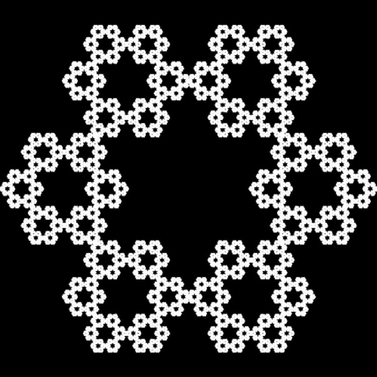
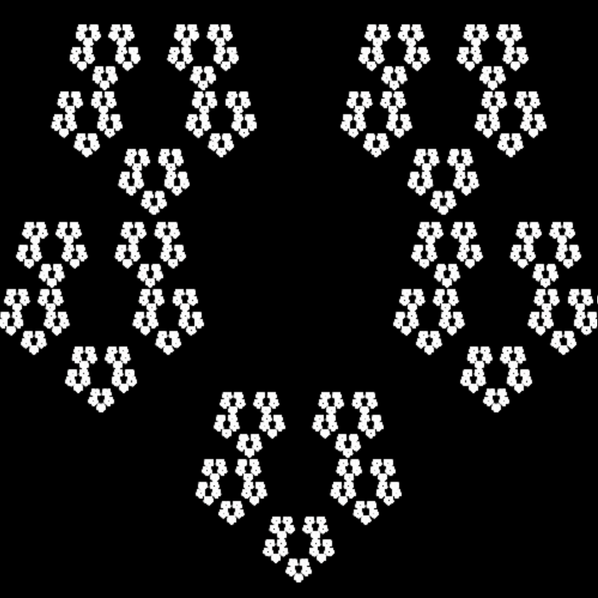
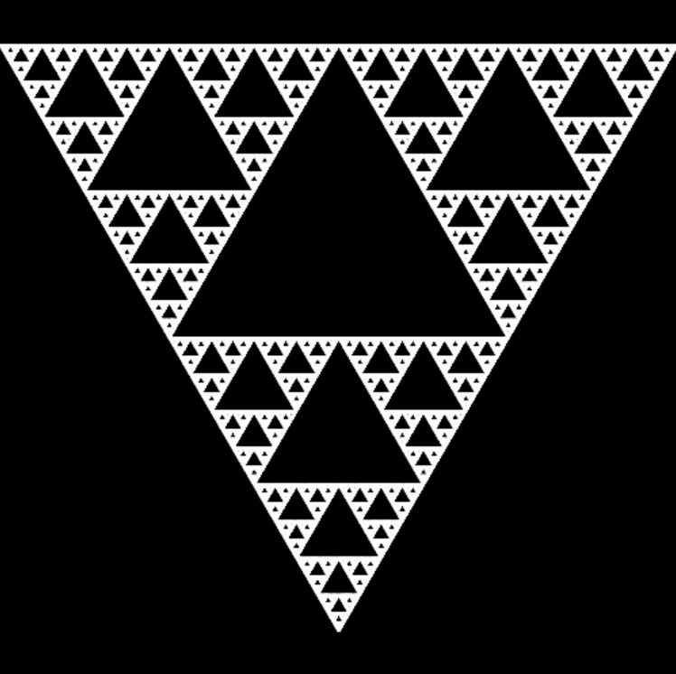

# Project for drawning Sierpinski shapes

### Makers:
* Viivi @laivii
* And a bit help gotten from Ville @Vsimpro

## This is a personal project out of love for Mathematics

Earlier this was a project for simply drawing Sierpinski hexagon. I have since made it more complex and a bit better version by switching language from python to Javascript and from vanilla to Jquery. 

I have made sure to store the earlier version to folder so you can still find the vanilla and Python version from this repository. Also all the pictures formed with python are stored in it's folder. The earlier README is also stored here if you are interested on reading about the first versions.

## Resent Updates
* Coding language changed from Python to JS
    * Also with this we changed from creating a png to drawing on a canvas
* I have made changes to the function names and how they work
* I have added some functionalities, like the dropdown for choosing shape and an information box
* Changed the size of the picture from 1000x1000px to 500x500px

## So how does it work?
In todays version (01.12.2022), user as in you, can choose from four different shapes:
* Triangle
* Square
* Pentagon
* Hexagon
And Javascript will present you a picture of that Sierpinski shape.

Sierpinski shapes are formed by placing dots (here colored pixels) to random places with a beforehand chosen scale as in the distance of the dots is always the same, only the direction changes.

Basic idea is that we choose a corner and go towards it a specific distance and draw a dot there (for triangle the length is always 1/2 for hexagon it's 2/3). Then we continue this for a random amount of times. The more dots we draw the more clear the picture will be.

### So to the actual code and how it works:
1. First you choose a shape
2. With what you chose the code will go to a function that gives us our scale, starting point and coordinates to the corners
3. with this information we will calculate our coordinates and form a list of them
4. We give that list to our function that draws or forms the picture
5. and TADA we will have a picture of that shape on our screens

## Here is one picture made with this code:
This picture has 10.000 points drawn. (with Python)

Here some pictures drawn with Javascript:
<table style="border: none;">
    <tr>
        <td></td> 
        <td><td> 
        <td></td>
    </tr>
</table>
